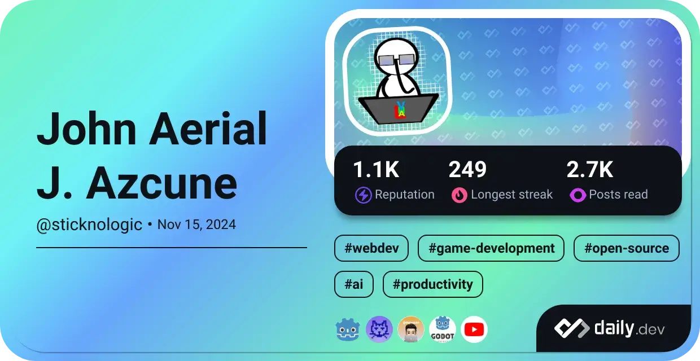

<!-- GitAds-Verify: 4D236LMAB9IUYXM3X5IQY27P5RVH5SRO -->

  

Web and App Developer specializing in digital design and pixel art. Skilled in Java, Dart, GDScript, and PHP, I utilize Android Studio, Godot and Flutter for development. My artistic tools include Photoshop, Canva, CapCut, Aseprite, and Illustrator. Excited to collaborate! 🎨Let's connect! 🚀 #WebDevelopment #AppDevelopment #PixelArt #DigitalDesign

<!---
STICKnoLOGIC/STICKnoLOGIC is a ✨ special ✨ repository because its `README.md` (this file) appears on your GitHub profile.
You can click the Preview link to take a look at your changes.
--->
